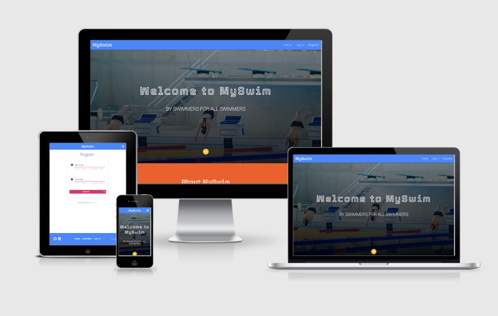
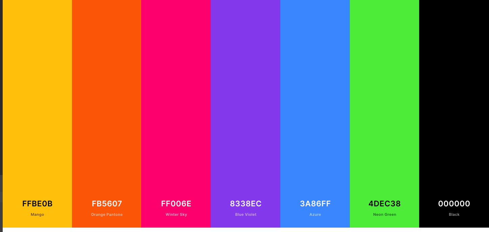
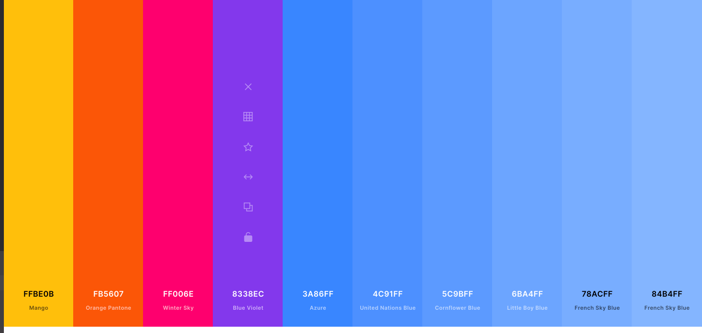

[](https://open.vscode.dev/organization/repository)

<h1 align="center">MySwim</h1>



[View the live project here.](https://my-swim.herokuapp.com/)

---

## Index

- <a href="#context">Context</a>
- <a href="#ux">UX</a>
  - <a href="#ux-overview">Overview</a>
  - <a href="#ux-stories">User stories</a>
  - <a href="#ux-wireframes">Wireframes</a>
  - <a href="#ux-design">Design</a>
- <a href="#database-model">Database Model</a>
- <a href="#features">Features</a>
  - <a href="#features-current">Existing</a>
  - <a href="#features-future">Desirable/Future</a>
- <a href="#technologies">Technologies Used</a>
- <a href="#testing">Testing</a>
- <a href="#deployment">Deployment</a>
- <a href="#credits">Credits</a>

---
## Context

<span id="context"></span>

Are you a swimmer looking for a convenient way to store and access your swim sets? If so, MySwim is made for you! Other than providing a secure place to store and access your swim sets, it also allows you to search for existing and new sets, that have been uploaded by fellow swimmers.

MySwim allows you to create a free account where you can add and save as many of your own swim sets, that are then shared with the MySwim community. You can save some of your favourite sets to your profile for convenient access. You can also print sets straight from the website.


<span id="ux-overview"></span>

## User Experience (UX)

MySwim is my third milestone project as a Code Institute student working towards a Diploma in Full Stack Software Development. It forms part of the Data Centric Development Module where the main aim is to "build a full-stack site that allows users to manage a common dataset about a particular domain."

As a swimmer, this site will provide personal value as a convenient means to store and access swimming programmes or sets. Having always relied on bits of soggy paper, stored here-and-there, the website will aim to alleviate this. It will also be beneficial to me as a swimmmer to have access to a collection of swimming sets, submitted by other swimmers, rather than constantly having to cycle through the same sets, or come up with new ones at the last minute.

<span id="ux-stories"></span>

- ### User stories

  - #### As a first time visitor, I want...

    1. To easily understand the main purpose of the site and learn more about what it offers.
    2. To see a large portion of the content without registering.
    3. To be able to search for swimming sets using appropriate keywords.
    4. A convenient registration process.

  - #### As a returning visitor, I want...

    1. A convenient login and logout process.
    2. To be able to search for swimming sets using appropriate keywords.
    3. To have access to a personal profile.
    4. To be able to save 'favourite' swimming sets created by other users under my profile.
    5. To be able to add new swimming sets.
    6. To be able to edit or delete swimming sets from my profile.

  - #### As the site owner/admin, I want...
    1. To manage categories (add, edit or delete).
    2. To be able to edit or remove content submitted by users.

<span id="ux-design"></span>

- ### Design

  - #### Colour Scheme

  - [Coolors](https://coolors.co/)
  - [MySwim Color Scheme 1](https://coolors.co/ffbe0b-fb5607-ff006e-8338ec-3a86ff-4dec38-000000)
  - [MySwim Color Scheme 2](https://coolors.co/ffbe0b-fb5607-ff006e-8338ec-3a86ff-4c91ff-5c9bff-6ba4ff-78acff-84b4ff)

  
  

  - #### Typography

    - [Google Fonts](https://fonts.google.com/)
    Tourney is a collaboration of tech and sport. At least, that is where the inspiration came from. Tourney would feel at home on a space ship or in a stadium. 
    - [Tourney Text](https://fonts.google.com/specimen/Tourney)
    At the same time, the font features friendly and open curves. While some grotesks distort their letterforms to force a rigid rhythm, Roboto doesn’t compromise, allowing letters to be settled into their natural width. This makes for a more natural reading rhythm more commonly found in humanist and serif types.
    - [Roboto](https://fonts.google.com/specimen/Roboto)

  - #### Imagery

    - Swimming, swimmers, water. 
    - Images obtained from [Unsplash](https://unsplash.com/)

<span id="ux-wireframes"></span>

- ### Wireframes

  - Wireframes can be viewed [here](https://github.com/Wingkelinks/myswim_MSP3/blob/master/wireframes/myswim_wireframes.pdf)
  - A site map can be viewed [here](https://github.com/Wingkelinks/myswim_MSP3/blob/master/wireframes/site_map.pdf)

<div align="right"><a style="text-align:right" href="#top">Back to index	:point_up_2:</a></div>

<span id="database-model"></span>

## Database Model

## Features

<!-- - Responsive on all device sizes

- Interactive elements -->

---
<span id="technologies"></span>

## Technologies Used

### Languages Used

- [HTML5](https://en.wikipedia.org/wiki/HTML5)
- [CSS3](https://en.wikipedia.org/wiki/Cascading_Style_Sheets)
- [Javascript](https://developer.mozilla.org/en-US/docs/Web/JavaScript)
- [Python](https://www.python.org/)
- [Jinja](https://jinja.palletsprojects.com/en/2.11.x/)

### Frameworks and Libraries

- [Materialize](https://materializecss.com/)
- [Google Fonts:](https://fonts.google.com/)
- [Font Awesome:](https://fontawesome.com/)
- [jQuery:](https://jquery.com/)
- [Icons8](https://icons8.com/) - for custom icons used on map.
- [CSS Grid](https://css-tricks.com/snippets/css/complete-guide-grid/): used to create responsive layouts.
- [Flexbox](https://css-tricks.com/snippets/css/a-guide-to-flexbox/): used to create responsive layouts.

### Extensions and kits

- [Flask Paginate](https://pythonhosted.org/Flask-paginate/)
- [Werkzeug](https://palletsprojects.com/p/werkzeug/)

### Project Management

- [Git](https://git-scm.com/)
- [GitHub:](https://github.com/)
- [MongoDB](https://www.mongodb.com/)
- [Heroku](https://www.heroku.com/about)
- [Balsamiq:](https://balsamiq.com/)
  - Balsamiq was used to create the [wireframes](https://github.com/) during the design process.

--
<span id="testing"></span>

## Testing

Full testing details can be found [here](TESTING.md)

--
<span id="deployment"></span>

## Deployment

The deployed version has been created using the master branch.

### Local Deployment 

The following is required to run this project in your local environment:

[Python 3](https://www.python.org/downloads/) - to run the code

[PIP](https://pypi.org/project/pip/) - for package installation

[Git](https://git-scm.com/) - used for version control

[MongoDB or MongoDB Atlas](https://www.mongodb.com/) - for database development 

[Visual Studio Code](https://code.visualstudio.com/) - or your own choice of IDE 

### Next you need to clone MySwim

To clone this project from its [GitHub repository](https://github.com/Wingkelinks/myswim_MSP3):

1. Click on the **Code** button 
2. Copy the clone URL for the repository: https://github.com/Wingkelinks/myswim_MSP3.git
3. From within your IDE, open your integrated terminal
4. Make sure you are in the correct folder location 
5. Then type **git clone** and paste the URL: https://github.com/Wingkelinks/myswim_MSP3.git
6. From there create an env.py file to store your credentials as follows:

      import os

      os.environ.setdefault("IP", "0.0.0.0")
      os.environ.setdefault("PORT", "5000") 
      os.environ.setdefault("SECRET_KEY", "") 
      os.environ.setdefault("MONGO_URI", "mongodb+srv://<username>:<password>@<cluster_name>-ofgqg.mongodb.net/<database_name>?retryWrites=true&w=majority") 
      os.environ.setdefault("MONGO_DBNAME", "my_swim") 

You can use a random key generator if you wish. 

7. This file MUST be hidden in your .gitignore file to keep credentials from being visibly pushed to the repository
8. You should be able to run the app by typing **python3 app.py** into the terminal

- In MongoDB you will need to create a database called MySwim.
- The following collections should be created:
  - sets
  - categories
  - users
- A document in categories should be created with the following fields:

| **Key**       | **Value** | **Type** |
| :------------ | :-------- | :------- |
| category_name | aerobic   | String   |

- The same applies for sets and users, however the sets collection has two fields of arrays:

| **Key**       | **Value** | **Type** |
| :------------ | :-------- | :------- |
| pre_set       | []        | Array    |
| main_set      | []        | Array    |


### How to deploy to Heroku

MySwim is deployed on Heroku from the master branch. To do this, the following steps were taken:

1. From your terminal, create a **requirements.txt** and **Procfile** using these commands:

```console
pip3 freeze --local > requirements.txt
echo web: python app.py > Procfile
```

2. Sign up and login to Heroku, **create a new app**
3. Name your app
3. Go to the **Deploy** tab and then **Deployment Method** and select **Github**
4. Under **Connect to Github** enter your details and connect your repository 
5. Next, go to **settings** and select **Config Vars** and then **Reveal Config Vars**
6. You need to enter the following variables to match what you have stored in your env.py file
    
    - **IP** : `0.0.0.0`
    - **PORT** : `5000`
    - **MONGO_URI** : `MONGO_URI", "mongodb+srv://<username>:<password>@<cluster_name>-ofgqg. mongodb.net/<database_name>?retryWrites=true&w=majority`
    - **SECRET_KEY** : `<app secret key>`

7. Under the **Deploy** tab go to **Automatic Deploys** and enable 
8. Under **Manual Deploy**, choose **Master** and click **Deploy Branch**
9. Heroku will begin building the app. When it is ready, you can click **Open app** to launch it.  

<div align="right"><a style="text-align:right" href="#top">Back to index	:point_up_2:</a></div>


--
<span id="credits"></span>

## Credits

### Tutorials / Resources

- Code Institute Task Manager Project ([Tim Nelson](https://github.com/TravelTimN))
- MS3 Strategy and Tips ([Ed Bradley](https://github.com/Edb83))
- Fellow Students MS3 Project ([Ed Bradley](https://github.com/Edb83))
- [Code Institute course material](https://learn.codeinstitute.net/ci_program/diplomainsoftwaredevelopment)
- Code Institute **Slack** channel
- [Mastering Markdown](https://guides.github.com/features/mastering-markdown/) - Guide to markdown on .md files.
- [CSS Tricks](https://css-tricks.com/) - convenient CSS resources. Regularly referenced their **Flexbox** tutorial.
- [Stack Overflow](https://stackoverflow.com/) - general questions and problem solving.
- [MDN Web Docs](https://developer.mozilla.org/en-US/) - general questions and problem solving.

### Code Referenced/Snippets

- [CSS3 Animation Notification](https://codepen.io/sugimo/pen/DgLty) - referenced to create custom flash messages
- [Print Page JQuery](https://www.geeksforgeeks.org/how-to-print-a-page-using-jquery/) - to initialise my print functionality
- [Tutorial by Cody Mind](https://www.youtube.com/watch?v=jSSRMC0F6u8) - dynamically add and delete form input fields
- [Dogfalo](https://github.com/Dogfalo/materialize/issues/192) - to customise the Materialize form input fields 

### Content

- All content was written by the developer.

### Media

- Images obtained from [Unsplash](https://unsplash.com/)

### Acknowledgements

- Thanks to my Mentor, Sebastian Immel for his guidance and support.
- Thank you to Ed Bradley, for his MS3 Tips and Strategies video. 
- Thank you to the Code Institue Slack community - a great place to check in and learn from others.

<div align="right"><a style="text-align:right" href="#top">Back to index	:point_up_2:</a></div>

