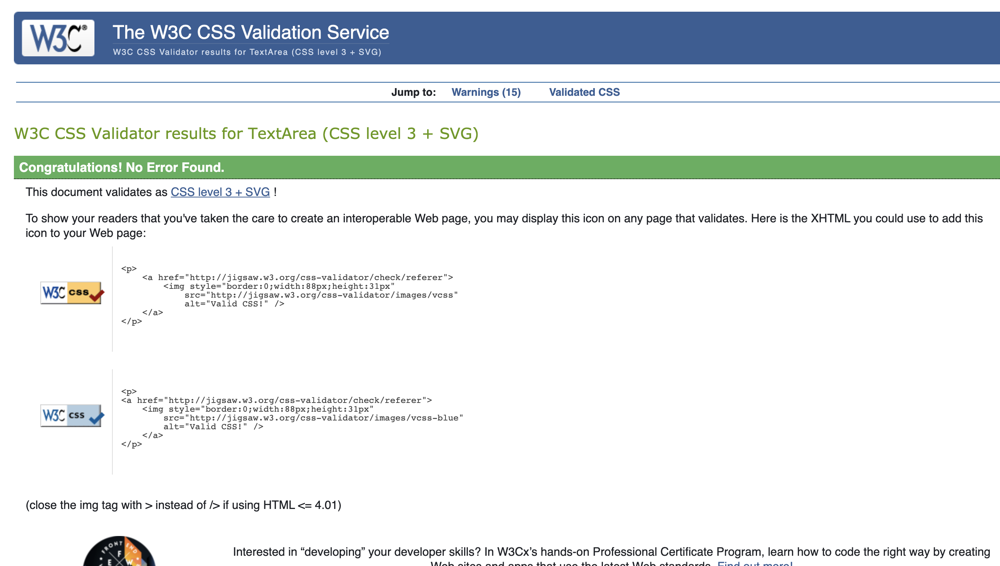
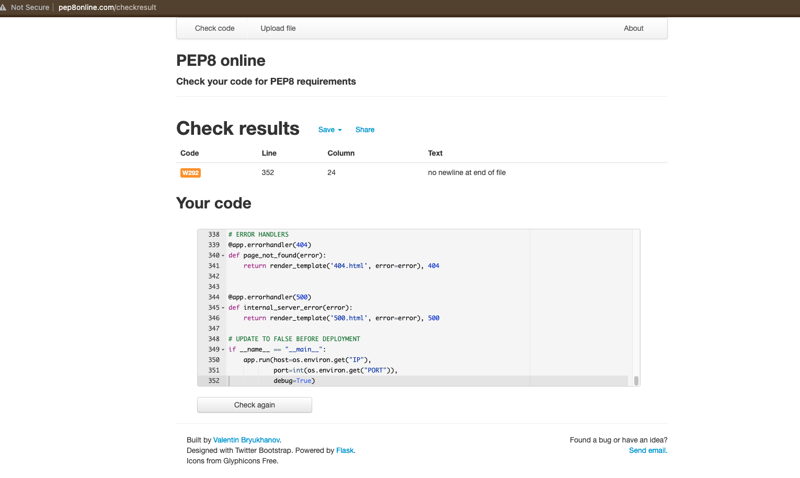
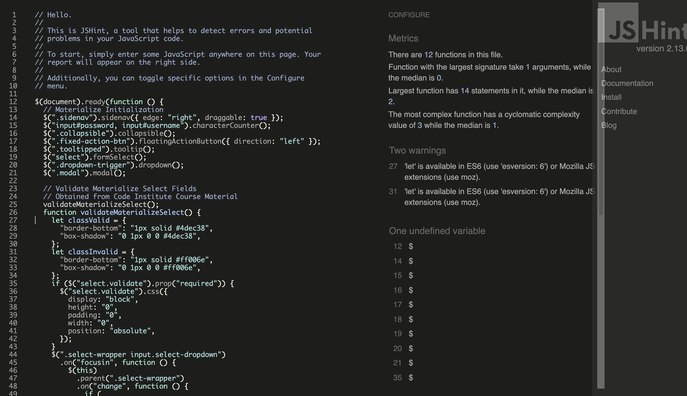
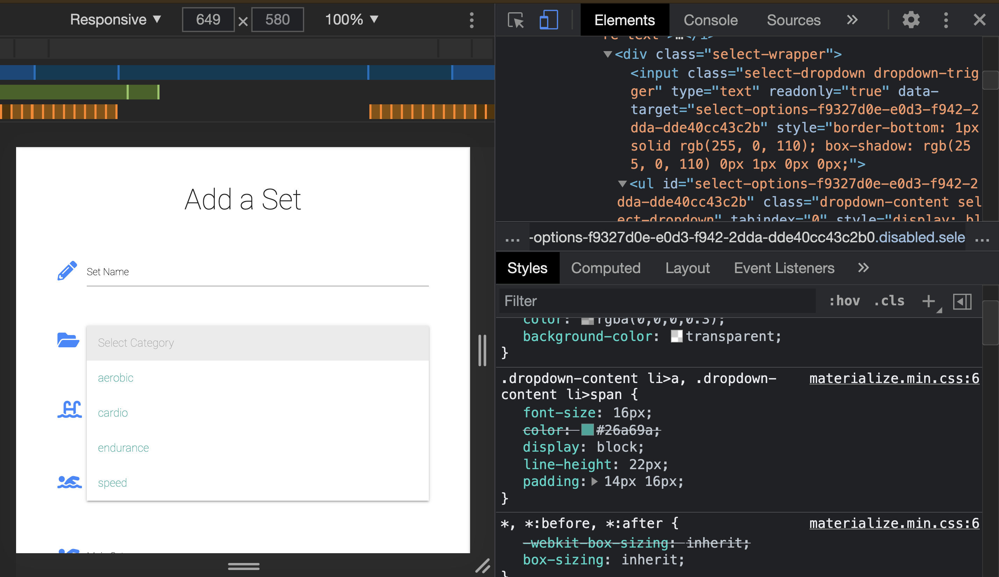
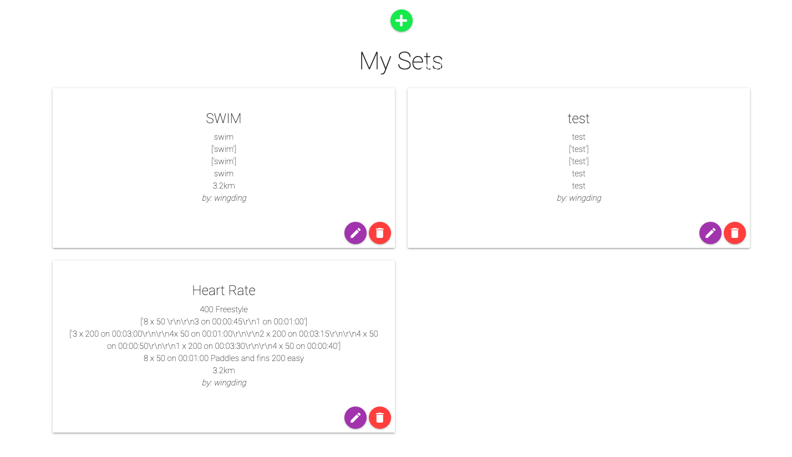
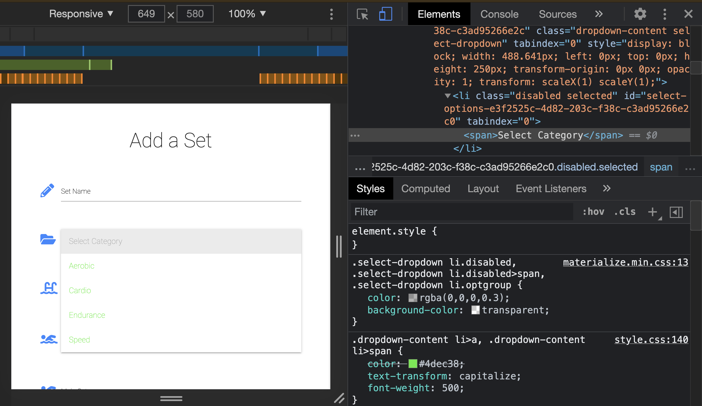
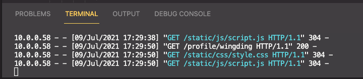
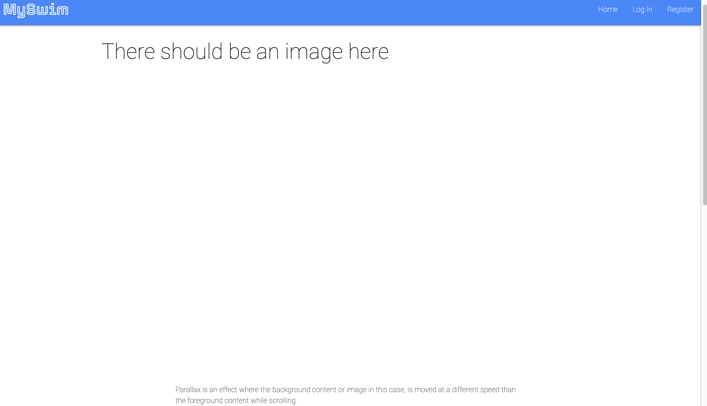

Back to [README.md](README.md)

## INDEX

- <a href="#user-stories">Testing User Stories from User Experience Section</a>
- <a href="#testing-manual">Manual</a>
- <a href="#testing-auto">Automated</a>
- <a href="#testing-responsive">Responsiveness</a>
- <a href="#testing-resolved">Resolved issues</a>
- <a href="#testing-unresolved">Unresolved issues</a>

---

># **TESTING**

## USER STORY TESTING 

- #### First Time Visitor Goals

  - Understand the purpose of the site

     1. A first time visitor will experience a simple, but striking home page that contains a hero-image, title and slogan that indicate that the site is about swimming.  
     2. The user is prompted to click an animated 'down arrow', which directs them to the about section, where they can learn about the full intention of the site. 
     3. From there, they are invited to register by clicking on a registration button.

  - Easy Navigation

     1. The Navigation is clean, responsive and easy to understand. 
     2. The Navbar and Footer are present on all pages, including Error pages. 
     3. The Footer includes top-level navigation links, for when a user is near the bottom of the page. 
     4. The title of each page is visible to the user in the browser window, which further indicates which page the user is on. 
     
  - Responsiveness

     1. The site is fully responsive to different screen sizes. This is largely achieved by using the Materialize Front-end framework in conjunction with small components from Tachyons - a CSS Toolkit.
  
  - Appealing Visual Design

    1. The site provides a good visual experience. 
    2. This is achieved by using a bright and bold color scheme that is consistent across all pages. 
    3. The page structure is kept clean and easily readable, by maintaining clear spacing and a simple layout. 
    4. Two clean and modern font styles are present across the site. They provide further consistency to the overall appearance. 
  
  - Intuitive UX Design

    1. Good UX ensures the user is not left guessing as to what to do, or where to go next. 
    2. This is assisted by including recognisable icons where user action is required.
    3. Alert messages are also present, to let the user know that an action has been performed. 
    4. Confirmation modals are used to ensure that the user is aware they are about to make an important change to their stored data. 

  - A convenient and secure registration process.

    1. The registration process for new users is straightforward as they are only required to enter a username and password. 
    2. Security is ensured by Werkzeug Security for password hashing.  

- #### Returning Visitor Goals

    As well as the above elements (with the exception of registration), returning visitors want the following: 

  - A convenient login and logout process.
  
    1. A returning visitor can easily re-enter the site, by simply entering their username and password. 

  - To be able to search for swimming sets using appropriate keywords.
    
    1. A search bar is present that allows users to filter search for swimming sets by category 
    and stroke names. 

  - To have access to a personal profile.
    
    1. Registered users have access to a personalised profile page where they can view the swimming sets that they have created.  

  - To be able to add new swimming sets.

    1. Users can add a new set by completing a form that is designed with the structure of  swimming programmes in mind. 
  
  - To be able to edit or delete swimming sets from my profile.

    1. Users also have the option of editing or deleting a set from their profile. 

  - To be able to save 'favourite' swimming sets created by other users under my profile.
    
    1. Registered users can also save their 'favourite' swimming sets. These are stored on a seperate page that is connected to their profile page. 

  - To be able to print a swimming set. 

    1. Registered users have the option of accessing a 'print friendly' version of any set of their choice. 

- #### As the site owner/admin, I want...

  - To manage all content (add, edit or delete).

    1. Admin access ensures nominated admin users have the ability to manage content across the site. 
    2. They can choose to edit or delete content submitted by users, including sets and categories. 

  - Admin also have access to their own profile page, where they too can submit swimming sets that are visible for all registered users to see. 

  - Admin can add their own favourites and access the 'print a set' page too. 

<a style="text-align:right" href="#top">Back to index	:point_up_2:</a>

---

## FURTHER TESTING

># **MANUAL TESTING**

<a style="text-align:right" href="#top">Back to index	:point_up_2:</a>

Manual testing was performed throughout the building process. The following is a breakdown of the different areas/components that have successfully passed manual testing. 

- #### Navigation

  1. All links in navigation tested and direct users to the correct pages. 
  2. Correct navigation options are visible to users in session:
   - Logged in user: Home, Profile, My Profile, New Swim, Search Sets and Log Out
   - Admin Logged in: All of the above including Manage Content
   - User not logged in: Home, Register, Log In

  3. The dropdown mobile menu displays links as above for different users. 

- #### Footer

  1. The footer displays essential navigation links for different users:
   - Logged in user: Home, Log Out
   - User not logged in: Home, Register, Log In

  2. Social media links all in working order and direct user to external pages in a new browser window. 

- #### Home Page

  1. The about section in the home page displays a different invitation for different users: 
   - Logged in users: are invited to 'check out the collection of swim sets'
   - Users not logged in: are invited to register before they have access to the swim sets  

- #### Registration and Log In Pages 

  1. Anybody can register for free. Passwords are hashed for using [Werkzeug Security](https://werkzeug.palletsprojects.com/en/2.0.x/utils/). If a user accidentally navigates to the register page, from there they can click on a log in link and vice versa. 

  2. The username and password validators are in place and check that users are meeting the requirements for both registration and log in processes. 
  
  3. Upon successful registration, a personalised welcome message is displayed to the new user. If unsuccessful, the user will be notified by a different alert letting them know that their username/password is incorrect. 

  4. When a user successfully logs in, they are directed to their profile page and greeted by a personalised welcome message. 

- #### Search Sets Page 

  1. The Search Sets page displays all available sets added by all users. 

  2. The Search Bar allows users to filter the available sets by entering some text (it is suggested they search by category or stroke). When they hit 'search', relevant sets will be displayed. Below the search bar, a message is displayed that informs the user of their search results. At this stage, if no results are returned, nothing gets displayed. A message to direct the user to try something else or direct them elsewhere would be desirable. 

  2. At this stage, pagination is not an included feature, but it is also a desirable one. 

- #### Add Set Page 

  1. Users can add a new swim set by clicking on the 'new swim' link. There they will be directed to fill in a form that includes fields relevant to a swim programme. 

  2. The input fields were developed from the Sets collection initially stored in MongoDB during the initial stages of development. 

  3. The 'Select Category' field which is viewed as a dropdown menu, is connected to the Category collection stored in MongoDB. If an admin user makes adjustments to a category, this field gets updated accurately. 

  4. The Pre Set and Main Set fields are stored as arrays in the database. This allows these fields to include additional entry fields that get added dynamically via some JQuery script. These are accurately rendered when a user submits the form. 

  2. Upon submission, the set is added to collection on the site and in the database itself.The user is then redirected to the Search Sets page and an alert message is displayed notifying them of a successful submission. 

- #### Edit Set Page 

  1. For general registered users, each set stored on their profile will display an edit button, that redirects them to a form for editing. 

  2. Admin users are able to edit any set from the Search Sets page. For admin, an edit button will be visible on all sets. 

  3. The form is prefilled based on the selected sets existing values/field entries. 

  4. The edit button updates the set in the database and on the site. The user gets an alert message notifying them that their set was succesfully updated. They remain on the Edit Set page. 

  5. The cancel button will redirect the user to the Search Sets page. 

- #### Profile Favourites and Print Pages

  1. A user's profile page displays their name and provides them with additional options to add a new set or to navigate to their Favourites page. All of the users stored sets are displayed as cards similar to those on the Search Set page, with the addition of three buttons: favourite, edit and print. 

  2. The Favourite page includes a user's selected favourites displayed alphabetically by set name in small cards. Each card contains a 'view' button which redirects the user to that set located on the Search Sets page. They can also choose to navigate back to their profile by clicking on a 'back to profile' button at the top of the page. 

  3. When a user 'favourites' a set from the collection, a new favourite is added to the database stored in a Favourites collection. Each favourite gets populated with the associated values for the set (id and name) as well as the user id. 
 
  4. When a user clicks on a print button, they are redirected to a page that renders their selected set in a print friendly manner. The name of the set gets displayed at the top of the page. They can choose to navigate back to their profile by clicking on a 'back to profile' button at the top of the page. The print function is initialised by some JQuery script, utilising the window.print() method. 

- #### Manage Content Page 

  1. The Manage Content page can only be accessed by admin users in session. It gives admin users the options to add, edit and delete categories. They can also add new sets from the Manage Content page.

  2. The Add Category button will direct users to a form that requires the input of a new category name. If they hit cancel, they will be redirected back to the Manage Content page. If they hit submit, they will receive an alert message notifying of a successful add. Categories are stored and added alphabetically. 

  3. The delete button will trigger a modal asking the user for confirmation before going ahead and deleting the category permanently. If they confirm deletion, an alert message will be displayed confirming that the category has been deleted. 

- #### Deleting Content (Admin and Users)

  1. The deletion process of sets is similar to that of category deletion mentioned above. If a user chooses to delete a set, a modal will be triggered that asks, "Do  you really want to delet your set {{ set.set_name }}? This cannot be undone!" If they choose to delete, the set is removed from the collection. If they select not to delete, they remain on their profile page. 

- #### Error Handler Pages

  1. In the event of 404 and 500 errors, pages with appropriate messages will be displayed. Both pages include buttons to invite the user to return to the Home page. 

---

># **AUTOMATED TESTING**

- ## [Chrome Dev Tools](https://developer.chrome.com/docs/devtools/)

  - Throughout the development process, DevTools was used for testing responsive behaviour on   small, medium and large screen sizes.
  - It was also consistently used to debug and prototype CSS.

  ### [Lighthouse](https://developers.google.com/web/tools/lighthouse)

- Used to check performance, accessibility and SEO potential on all pages of the website.
*Across all pages:*
  - Performance: 81%
  - Accessibility: 80%
  - Best Practices: 100%
  - SEO: 90% 

- ## [W3C Markup Validator](https://jigsaw.w3.org/css-validator/#validate_by_input)

No errors or warnings to show. 

- ## [W3C CSS Validator](https://jigsaw.w3.org/css-validator/#validate_by_input)

No errors found, 15 warnings 

- ## [Python Validator](http://pep8online.com/)

Initial Pep8 tests showed some refactoring was required, mainly removing whitespace and fixing some indenting issues. Everything was cleared apart from what is shown in the image below: 

- ## [JavaScript Validator](https://jshint.com/)

1 undefined variable, 2 warnings  

<a style="text-align:right" href="#top">Back to index	:point_up_2:</a>

## 

># **RESPONSIVENESS**

## CROSS BROWSER COMPATIBILITY

Browsers tested:

- Chrome *v.90*
- Microsoft Edge *v.90*
- Firefox *v.88*
- Safari *v.14*

## VARIED SCREEN SIZES

Chrome DevTools used to test: 

- Moto G4
- iPhone 4 
- Galaxy S5
- Pixel 2
- Pixel 2 XL
- iPhone 5 SE
- iPhone 6/7/8
- iPhone 6/7/8 Plus
- iPhone X
- iPad
- iPad Pro
- Surface Duo 
- Galaxy Fold 

<a style="text-align:right" href="#top">Back to index	:point_up_2:</a>

## RESOLVED

## UNRESOLVED

- Unable to implement **Remove Favourites** function.
- Was not able to fix sizing of buttons in form that get added dynamically through JQuery script when a user adds a new input field to the *pre_set* and *main_set* fields of the 'add set' form. 

